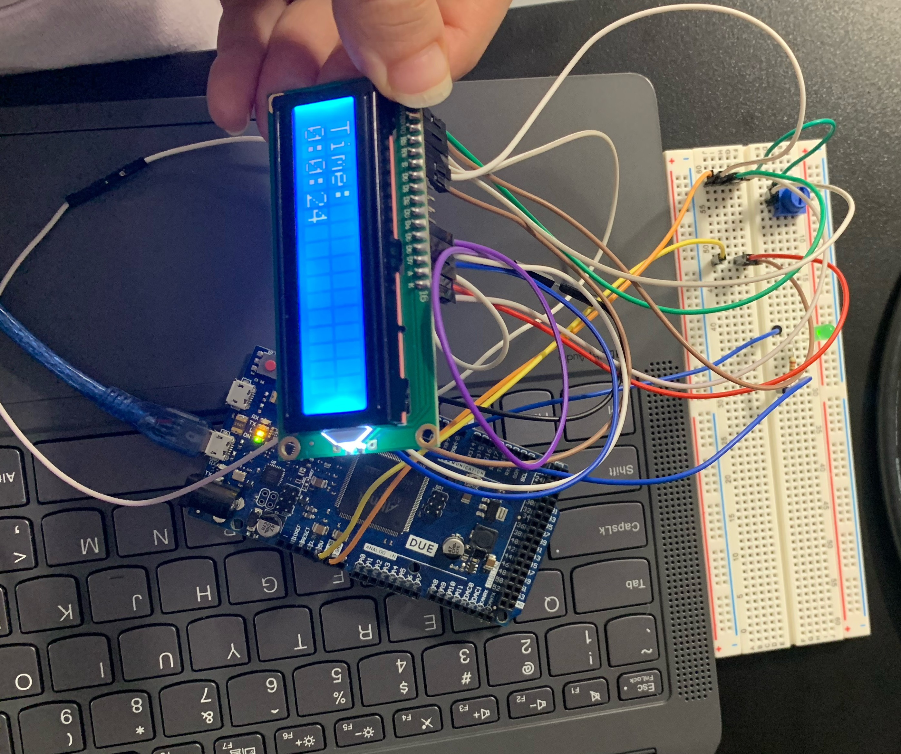

# CPE 322: Design VI
I am a *computer engineering* student at Stevens Institute of Technology graduating **May 2026**!

> "Develop a passion for learning. If you do, you will never cease to grow" - Anthony J. D'Angelo
---
## Classes I am currently taking: 
1. CPE 487 Digital System Design
2. CPE 345 Modeling and Simulation
3. CPE 595 Applied Machine Learning
4. CS 392 Systems Programming
---
[My GitHub Page](https://github.com/MariamElnaggar) has all my projects. Check it out!   
## Programing Languages I have used:
- Python  
  `print("Hello World!")`
- C/C++  
  `cout << "Hello World!" << endl;`
- Java  
  `System.out.println("Hello World!");`
---
## Arduino Project

